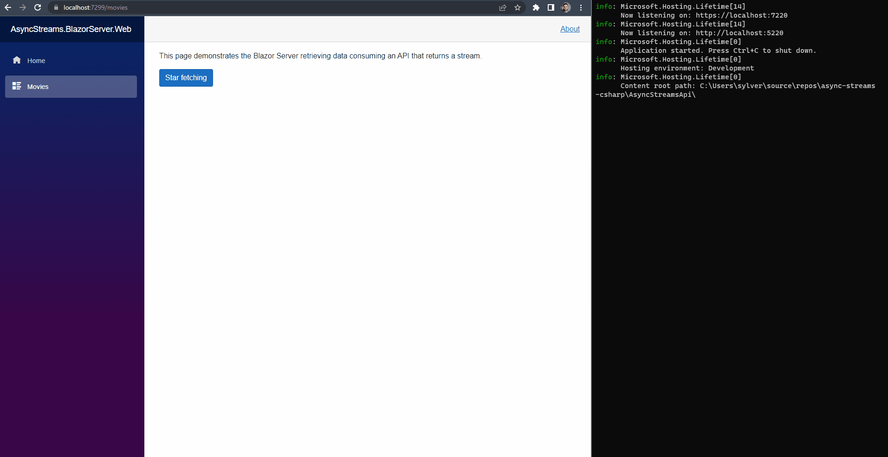

# async-streams-csharp

This project demonstrates the use of async streams in c# with the use of the ```IAsyncEnumerable``` interface, in both backend and frontend.

# Movies endpoint

## AsyncStreamsApi

This API has the ```/api/movie``` endpoint that returns an ```IAsyncEnumerable<Movie>```, which means that the response can be read as a stream.

The ```MovieController``` depends on ```IMovieRepository```, that has two implementations: (i) ```MovieCsvRepository```, which reads the data from a csv file, and (ii) ```MovieSqlRepository```, which reads data from a SQL Server database.

- **StreamDelayInMilliseconds (appsettings.json):** configuration to add delay time between record fetches, to help to see the effect of the stream.

## AsyncStreams.BlazorServer.Web

A Blazor Server project that has a JSON stream consumer.

## AsyncStream.BlazorWasm.Web

A Blazor Web Assembly (Wasm) project tha has a JSON stream consumer.

The only difference of this project compared to ```AsyncStreams.BlazorServer.Web``` is that in order to read de response as stream is required to set the ```WebAssemblyEnableStreamingResponse``` option in ```HttpRequestMessage```, to ```true``` in ```Movies.razor``` file.

## Screen capture

### Querying

This image shows the effect of the stream considering a delay between records of 500ms. When the **Star fetch** button is clicked, the stream starts, and there is no need to wait until all records have been fetched to show them on screen. So, as soon as a record is fetched, it is displayed on the screen. In the right side is the API log, that shows the moment when the record was fetched.



### Cancellation logic

In ```Movie.razor``` file at **BlazorServer** project, there is a logic tha uses ```CancellationToken``` to cancell the http request when the movie view is disposed, for exemple, when the user navigates to the home view. The feature of cancelling http requests it's not net supported in blazorwasm projects. The screen capture shows that when the user navigates to home view, the API stop to fetch the records.

